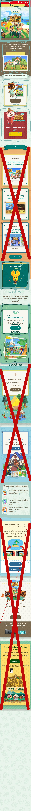
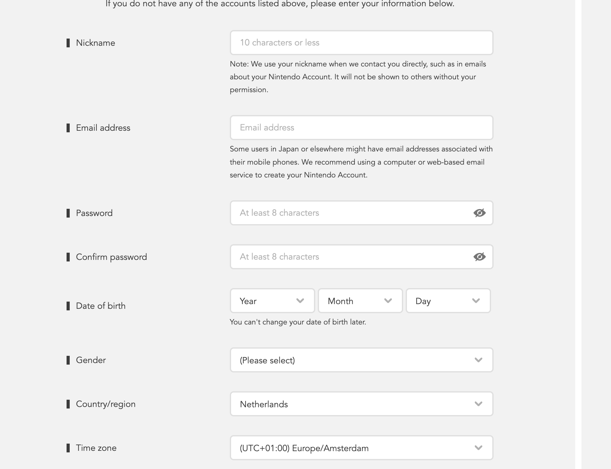

# Procesverslag
Markdown is een simpele manier om HTML te schrijven.  
Markdown cheat cheet: [Hulp bij het schrijven van Markdown](https://github.com/adam-p/markdown-here/wiki/Markdown-Cheatsheet).

Nb. De standaardstructuur en de spartaanse opmaak van de README.md zijn helemaal prima. Het gaat om de inhoud van je procesverslag. Besteedt de tijd voor pracht en praal aan je website.

Nb. Door *open* toe te voegen aan een *details* element kun je deze standaard open zetten. Fijn om dat steeds voor de relevante stuk(ken) te doen.

## Jij

  
uitwerken voor kick-off werkgroep

  ### Auteur:
  Alexia wiersma

  #### Je startniveau:
  Rood

  #### Je focus:
  iki wil proberen om responsive en surface plane allebei toe te passen in mijn website.

  https://github.com/Alexiatech/FED
 

## Je website

  
uitwerken voor kick-off werkgroep

  ### Je opdracht:
  link naar de website die je gaat namaken óf de naam/omschrijving van je eigen ontwerp

  #### Screenshot(s) van de eerste pagina (small screen): 
  hier de naam van de pagina  
  

  #### Screenshot(s) van de tweede pagina (small screen):
  hier de naam van de pagina  
  
 

## Toegankelijkheidstest 1/2 (week 1)

  
uitwerken na test in 1e werkgroep

  ### Bevindingen
  Lijst met je bevindingen die in de test naar voren kwamen:

  het is niet altijd makkelijk om op een laptop te werken als je een beperking hebt. 
  daarom kwam ik erachter dat je het goed moet na kijken als of je website wel toegangelijk is veer deze gebruikters. 

  tijdens het testen van de website viel mij wel op dat de buttons we groter waren dan ander buttons van sites. 

  #### Screenreader
  Hier korte omschrijving (met indien nodig afbeeldingen)

  Hier een omschrijving van hoe het opgelost kan worden (met indien nodig afbeeldingen)

  door text neer te zetten die je niet ziet maar mensne die een screenreader gebruiken wel kunnen horen. 

  #### Muis en Toetsenbord 
  Hier korte omschrijving (met indien nodig afbeeldingen)

  Hier een omschrijving van hoe het opgelost kan worden (met indien nodig afbeeldingen)

  ander soort toetsen bord en muis kopen. 

  #### Motoriek (shocks, elastiekjes)
  Hier korte omschrijving (met indien nodig afbeeldingen)

  Hier een omschrijving van hoe het opgelost kan worden (met indien nodig afbeeldingen)

  lastig om bepaalde bewegingen uit te voeren met je vingers. hiervoor kan je ervoor zorgen
  dat je websiten niet alle kanten op gaan met de content en linkjes. 

  #### Visueel (brillen, contrast, kleurenblind, dark/light). 
  Hier korte omschrijving (met indien nodig afbeeldingen)

  soms word er geen uitleg vetelt wat de link precies doet. er wordt te weining informatie vertelt. 

  Hier een omschrijving van hoe het opgelost kan worden (met indien nodig afbeeldingen)

## Breakdownschets (week 1)

  
uitwerken na afloop 2e werkgroep

  ik heb tot nu toe alleen de opdrachten gemaakt. 

  ### de hele pagina: 
  

  ### dynamisch deel (bijv menu): 
  

  ### wellicht nog een dynamisch deel (bijv filter): 
  

## Voortgang 1 (week 2)

  
uitwerken voor 1e voortgang

  ### Stand van zaken
  Ik ben de laatste 2 weken bezig geweest om alle opdrachten te maken van frontend deveploment. 
  Door deze opdrachten kan ik wel verder komen met mijn eigen website. 
  sommige opdrachten waren wel moeilijker maar ik snap nu wel wat de meeste css is.

  ### Agenda voor meeting
  samen met je groepje opstellen

  | student 1      | student 2          | student 3    | student 4        |
  | ---            | ---                | ---          | ---              |
  | dit bespreken  | en dit             | en ik dit    | en dan ik dat    |
  | en dat ook nog | dit als er tijd is | nog een punt | dit wil ik zeker |
  |                | ...                | ...          | ...              |

iedereen andere vragen gesteld over hun eigen website. 
  ### Verslag van meeting
  hier na afloop snel de uitkomsten van de meeting vastleggen

  - punt 1
  - punt 2
  - nog een punt
  - ...

## Voortgang 2 (week 3)

  
uitwerken voor 2e voortgang

  ik had een slomme start maar na dat ik alle opdrachten had gemaakt was ik begonnen aan mijn website. hier liep ik wel tegen dingen aan maar ik heb de opdrachten gebruikt alks hulp middelen en zo kwam ik er wel doorheen. 

  ### Stand van zaken
  hier dit ging goed & dit was lastig (neem ook screenshots op van delen van je website en code)

  met css moest er weer even inkomen. 

de opdrachten gignen goed de zwarte piste was nog iets te moeilijk voor mij dus heb alleen de 
  ### Agenda voor meeting
  samen met je groepje opstellen

  | student 1      | student 2          | student 3    | student 4        |
  | ---            | ---                | ---          | ---              |
  | dit bespreken  | en dit             | en ik dit    | en dan ik dat    |
  | en dat ook nog | dit als er tijd is | nog een punt | dit wil ik zeker |
  | ...            | ...                | ...          | ...              |

iedereen andere vragen gesteld over hun eigen website. 

  ### Verslag van meeting
  hier na afloop snel de uitkomsten van de meeting vastleggen

  - punt 1
  - punt 2
  - nog een punt
- ...

## Toegankelijkheidstest 2/2 (week 4)

  
uitwerken na test in 8e werkgroep

  ### Bevindingen
  Lijst met je bevindingen die in de test naar voren kwamen (geef ook aan wat er verbeterd is):

  Bepaalde plaatjes hadeen een naam maar dan is het nog niet duidelijk voor een blind persoon.
  bepaalde knoppen zijn niet te begrijpen voor mensen die blind zijn omdat hij text maar de content van de text zit in de img. 

  #### Screenreader
  Hier korte omschrijving (met indien nodig afbeeldingen)

  Hier een omschrijving van hoe het opgelost kan worden (met indien nodig afbeeldingen)
  
  door een span toe te voegen. in die span text te zetten en ik css aangeven met code dat deze text niet zichtbaar is maar wel voor de mensne die viocescreen gebruiken, zodat zij mee krijgen wat de content is. 

  #### Muis en Toetsenbord 
  Hier korte omschrijving (met indien nodig afbeeldingen)

  Hier een omschrijving van hoe het opgelost kan worden (met indien nodig afbeeldingen)

  #### Motoriek (shocks, elastiekjes)
  Hier korte omschrijving (met indien nodig afbeeldingen)

  Hier een omschrijving van hoe het opgelost kan worden (met indien nodig afbeeldingen)
  Met een moterieke beperking is het lastiger om op kleine buttons te drukken dus maak deze buttons groter en duidelijk (achtergrond en button background moet goed van elkaar onderscheiden. 

  #### Visueel (brillen, contrast, kleurenblind, dark/light). 
  Hier korte omschrijving (met indien nodig afbeeldingen)

  Hier een omschrijving van hoe het opgelost kan worden (met indien nodig afbeeldingen)

## Voortgang 3 (week 4)

  
uitwerken voor 3e voortgang

    een groot deel van mijn website was al af en  moest alleen bepaald elementen toevoegen. soms liep ik wel vast met javacript maar uit eindleijk met een 
    beetje hulp kwam ik er wel doorheen. 

  ### Stand van zaken
  hier dit ging goed & dit was lastig (neem ook screenshots op van delen van je website en code)

  ### Agenda voor meeting
  samen met je groepje opstellen

  | student 1      | student 2          | student 3    | student 4        |
  | ---            | ---                | ---          | ---              |
  | dit bespreken  | en dit             | en ik dit    | en dan ik dat    |
  | en dat ook nog | dit als er tijd is | nog een punt | dit wil ik zeker |
  | ...            | ...                | ...          | ...              |

iedereen andere vragen gesteld over hun eigen website. 
  ### Verslag van meeting
  hier na afloop snel de uitkomsten van de meeting vastleggen

  - punt 1
  - punt 2
  - nog een punt
  - ...

## Eindgesprek (week 5)

  
uitwerken voor eindgesprek

na 4 weken hard te hebben gewerkt heb ik mijn opdracht af gekregen. 

  ### Je uitkomst - karakteristiek screenshots:
  

  ### Dit ging goed/Heb ik geleerd: 
  Korte omschrijving met plaatjes

  

  ### Dit was lastig/Is niet gelukt:
  Korte omschrijving met plaatjes

  javascrip-t blijft last voor mij maar wil der wel meer van leren zodat ik later het goed begrijp. 
  

## Bronnenlijst

  
continu bijhouden terwijl je werkt

  Nb. Wees specifiek ('css-tricks' als bron is bijv. niet specifiek genoeg).

  1. // bron https://codepen.io/diegoleme/pen/qBpyvr
  2. https://css-tricks.com
  3. https://www.w3schools.com/
  4. 

